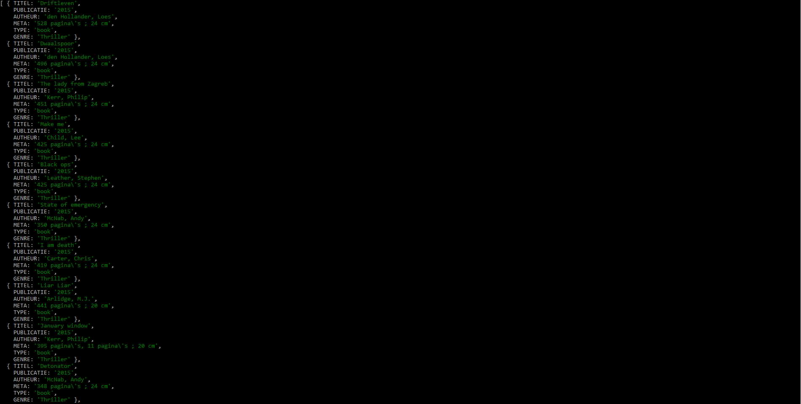

# Functional Programming
⚠️⚠️⚠️ Vanwege vakantie bestaat deze readme voorlopig uit de 1e week van functional programming ⚠️⚠️⚠️
Deze readme bestaat uit het onderzoek over de data van de OBA API. Hieronder is terug te lezen wat ik tijdens dit project heb gedaan en welke onderzoeksvragen ik heb opgesteld. 

## Inhoud
* [To Do](#to-do)
* [Installatie](#installatie)
* [Interessante data](#interessante-data)
* [Onderzoeksvragen](#onderzoeksvragen)
* [Problemen](#problemen)
* [Shout outs](#shout-outs)
* [Licentie](#licentie)

## To-Do
Tijdens dit project vond ik het lastig om uit te zoeken wat ik precies stap voor stap kon doen. Dit stappenplan van [Laursens](https://github.com/Razpudding) heeft mij hierin geholpen.

- [X] Hello API.
- [X] What the 🐒 zit er in de API? Krijg een idee van de informatie die je uit de API kan halen.
- [X] Verzin onderzoeksvragen.
- [X] Verzin deelvragen.
- [X] Bedenk welke variablen je nodig gaat hebben om je vraag te beantwoorden.
- [X] Haal deze data uit de API en sla die op in jouw eigen "datastore".
- [X] Doorzoek die data op patronen
- [ ] Visualiseer de patronen met D3

## Instalatie
Om dit project te installeren ga je naar je *terminal* en voer je dit uit : 
```
git clone https://github.com/Roene/functional-programming
cd functional-programming
npm install rijkvanzanten/node-oba-api
npm install
```
Dit project maakt gebruik van de volgende packages :
* [node-oba-api](https://github.com/rijkvanzanten/node-oba-api)
* [dotenv](https://www.npmjs.com/package/dotenv)

## Interessante data
📊 Tijdens het zoeken binnen de API ben ik gaan kijken welke data er terug kwam en welke hier interessant van is. 
* Titel
* Publicatie jaar
* Autheurs 
* Aantal pagina's van het boek & lengte in cm
* Genre(s) 
* Samenvatting van het boek

## Onderzoeksvragen
De eerste onderzoeksvragen die ik heb opgesteld waren deze :
* Zijn er meer boeken van Ajax dan van Feyenoord?
* Zijn er minder Engelse boeken dan Nederlandse boeken?
* Zijn er meer boeken met het genre horror dan met het genre fantasy?
* Gaan de meeste geschiedenis boeken over de WOII?

Deze vragen waren nog niet goed genoeg aangezien dit voornamelijk ja/nee vragen waren, deze feedback kwam van klasgenoten. 
Vandaar dat ik nieuwe vragen ben gaan opstellen deze staan hieronder :

* Hoe zijn thrillerboeken ten opzichte van de sciencefictionboeken gegroeid in de periode 1975-2018?
* Zijn er sinds de invoering van de vrouwenrechten in Nederland meer vrouwelijke schrijvers gekomen?
* Heeft het aantal pagina's van een boek invloed op de hoogte van het boek?
* Zijn bepaalde genres sinds 1975 verdwenen / minder populair geworden? 
* Hoe zijn de boeken over de islam ten opzichte van de boeken over het christendom gegeroeid sinds 1990?

De vraag die ik het meest interessantste vond is de volgende : *Hoe zijn thrillerboeken ten opzichte van de sciencefictionboeken gegroeid in de periode 1975-2018?*
Vervolgens ben ik voor deze vraag deelvragen gaan opstellen :

* Zijn er meer boeken met het genre thriller bij gekomen dan het genre sciencefiction?
* Zijn de thrillerboeken dikker geworden ten opzichte van de sciencefiction
	* Zijn hier nog speciale redenen voor? (Films die zijn uitgekomen bijvoorbeeld)
* Is er een verschil tussen de jaren heen van het aantal schrijvers voor deze genres?
* Zijn er meer Nederlandse thrillerboeken dan Engelse thrillerboeken?

## Hypothese
**H1** Sinds 1975 zijn er meer thrillerboeken dan sciencefiction bijgekomen

## Verwachte data
Ik verwacht deze data nodig te hebben om mijn onderzoeksvraag + deelvragen te beantwoorden :
* Genres (thrillers & siencefiction)
* Publicatiedatum (1975 t/m 2018) 📅
* Aantal pagina's van het boek + lengte
* Type (boek) 📚
* Autheur(s)

Wat eventueel handig kan zijn (denk ik?) :
* Titels
* Samenvatting
* Taal



De volgende code regelt dit : 
```js
// Bron code van Laurens | 31-10-2018 | College
  .then(results => JSON.parse(results))
  .then(results => {
    var myData = getKeys(results)
  })

function getKeys(data){
  var myData = data.aquabrowser.results.result.map(e => {    
    return {
      TITEL: e.titles['short-title'].$t,
      PUBLICATIE: e.publication? parseInt(e.publication.year.$t, 10) : "GEEN PUBLICATIE DATUM",
      AUTHEUR: e.authors? e.authors['main-author'].$t : "GEEN AUTHEUR",
      META: e.description? e.description['physical-description'].$t : "GEEN META DATA",
      TYPE: e.formats? e.formats.format.$t : "TYPE ONBEKEND",
      // GENRE: e.genres? e.genres.genre.$t : "GEEN GENRE",
      // Bron Jesse Dijkman
      GENRE: e.genres? e.genres.genre.length > 1? e.genres.genre.map(x => x.$t) : e.genres.genre.$t : "GEEN GENRE", 
      // Einde bron Jesse Dijkman     
    }
  })
  console.log(myData)
}
```

## Bevindingen
Tijdens de eerste dag zoeken in de API ben ik tot de volgende bevindingen gekomen :
* Je krijgt maar 20 resultaten per keer maar je kan met page: '2' een andere pagina opvragen.
* Veel data heb je niet nodig zoals bijvoorbeeld frabl & notes.
* Sommige data komt terug als *object* of als *array*.

Nadat ik erachter ben gekomen hoe ik data naar mijn eigen structuur kan schrijven ben ik gaan filteren op data die ik zelf wilde hebben. 
Vervolgens ben ik gaan kijken of ik al kon kijken of ik wat nuttige informatie uit deze data kon halen. Zo ben ik erachter gekomen dat :
* Het eerste thrillerboek in de OBA uit 1982 komt en 170 pagina's heeft
* Het nieuwste thrillerboek in de OBA uit 2018 komt en 374 pagina's heeft. 
* Het eerste sciencefictionboek in de OBA komt uit 1991 en 298 pagina's heeft.
* Het nieuwse sciencefictionboek in de OBA komt uit 2018 en 237 pagina's heeft.  
* Voor boeken met het genre Thriller zijn er 455 pagina's.
* Voor boeken met het genre sciencefiction zijn 237 pagina's 

## Problemen
Tijdens het vak ben ik op de volgende problemen / vragen gekomen
* Het uitzoeken van hoe de API precies werkt, wat zijn de mogelijke opties om op te zoeken?
* Hoe kan ik filteren op verschillende data?
* Hoe kan ik het omschrijven naar mijn eigen data?
	* Hoe ga ik dit vervolgens opslaan?
* Hoe ga ik deze data visualisren?

## Shout outs
🙏🏻 Special thanks naar deze mensen die mij hebben geholpen tijdens dit project. 🙏🏻
* [Daniel van de Velde](https://github.com/DanielvandeVelde)
* [Jesse Dijkman](https://github.com/jesseDijkman1)

## Licentie
[MIT](https://choosealicense.com/licenses/mit/) © [Roene Verbeek](https://github.com/Roene)